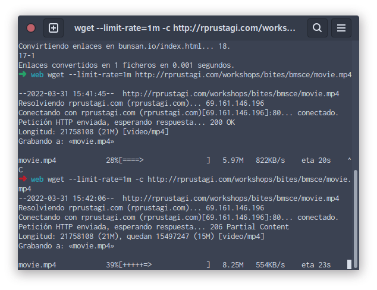
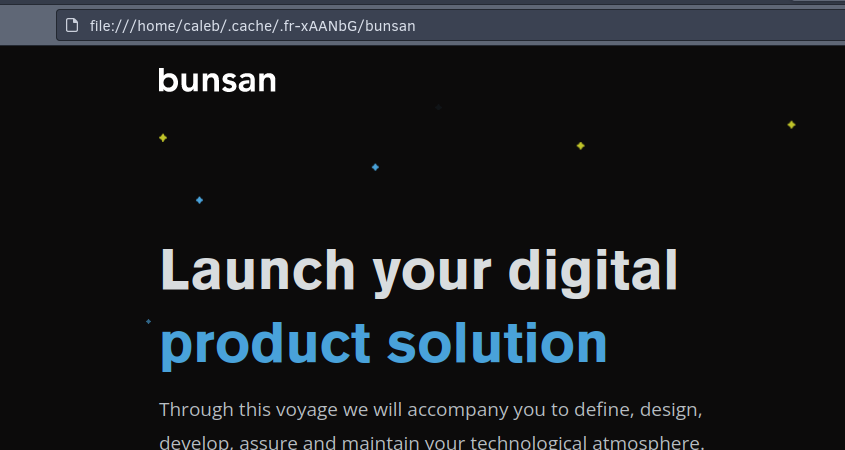

### Using wget
1. Open a terminal2.   
2. Mimic   (option   –mk)   your college website   http://www.bmsce.in, and access  
locally (turn off your internet).  

    

3.   Download a large file   using the   --limit-rate=1m   e.g.  
http://rprustagi.com/workshops/bites/bmsce/movie.mp4, break the download  
by pressing Ctrl-C   after about 5MB is downloaded   and then download with  
resume option (-c).   Ensure full download occurs and see if you can watch the  
movie after complete download.

    
    
4.   Explore other options   such as   –d for debug headers,   -O to save into a file

    
    
### Using ping
1.   Ping   google.com   and   yahoo.com   by sending some fixed count packets  e.g. 20. Analyze the response times and variation in response times.  
    
    
    
    
    
2.   Ping myweb.com with count of 10 pacekts.  
   
    
   
   
3.   Ping these sites again in quite mode.  
    
    
    
4.   Use ping with   changing interval duration to 0.2s from the default of 1s as well   as changing packet size from 56bytes to 1000 bytes.  
    
    
    
### Status code 200

1.   Access your college website with wget using debug options e.g.   wget   –d   http://www.bmsce.in  
    
    
    
3.   Analyze HTTP request and response message i.e.  
    a.   Request line - GET / HTTP/1.1
    b.   HTTP Request headers  - Host: www.bunsan.io, User-Agent: Wget/1.21.3, Accept: any media type, Accept-Encoding: Content-coding is always acceptable, Connection: persistent. 
    c.   Status line of HTTP Response -  HTTP/1.1 200 OK
    d.   HTTP Response headers.  - Server: request handled by openresty, Content-Type: text/html, Content-Length: entity-body has a size of 45681 bytes, Connection: Persistent, Accept-Ranges: The server accept parcial requests, Via: Via varnish proxy.
    
### Content-Type  
1.   Access the url  https://www.w3.org/TR/PNG/iso_8859-1.txt  
2.   Look at the content displayed on   browser.  
    
    
    
4.   Analyze the wireshark capture to study the header   Content-Type:  
    
    
   
   The Content-Type representation header is used to indicate the original media type of the resource.
   
6.   Repeat the exercise with   wget.  
   
    
    
8.   Study the headers.

### Status code 404

1.   Access a non-existence webpage e.g   nonexist.html  
2.   Check the status code in wireshark.  
    
    
    
3.   Verify this status code using   wget   as well.
    
    
    
###   Status code 400  
1. To experience this access code, we need to use   nc. By default, both browser  and   wget   send the proper HTTP header.  

2. This exercise requires that client should send invalid header e.g. ‘Host  myweb.com’ instead of ‘Host:   myweb.com’. Please note that HTTP  header field name should be separated by its value by Colon (:) character.  

3. Create a text file   e.g.   req-badhdr.txt   (7.3)   with bad headers.  
    _GET   /welcome.html HTTP/1.1  
    Host 10.211.55.9  
    User-Agent:   BMSCE   and BITES  
    Accept: */*  
    Accept-Language: en-us,en;q=0_
    
4. Send the bad headers using nc e.g.  cat req-badhdr.txt | nc myweb.com 80  
    
    

5.   Analyze the response given by web server and verify that it corresponds to  ‘400 Bad Request’.  

6.   Make another access with different header with syntax error.  
    
    

7.   Verify the Bad Request error

### Using compression 

1. To ensure that HTTP Request contains header corresponding to compression,  create a simple text file e.g.   req-gzip.txt  containing header  Accept-Encoding: gzip.

3. Make a request using this header e.g.   cat req-gzip.txt | nc myweb.com 80   >abc.html.gz  

4. Analyze the response. Uncompress (gunzip abc.html.gz) it to get the  
original contents.  

    

4. Make a request using wget for HTTP response with compression. Use the   wget   option   --header   to make such a request.   wget --header=”Accept-Encoding: gzip” http://myweb.com/welcome.html   -O welcome.html.gz  

    
    
    
    
6. Analyze the response as well.

### Using Caching 

1. Using wget   –   http://rprustagi.com/workshops/web/welcome.html   , note down   value of response header “Last-Modified:”, as well as that of “Etags:”

    

2. Using wget header option, pass on the value corresponding to response header  “Last-Modified” in previous step,   e.g.  
wget   --header=”If-Modified-Since:   Tue, 03 Jul 2018  17:27:18 GMT”  
    
    
    
3. Analyze the response and verify that status is 304 and not 200. 

