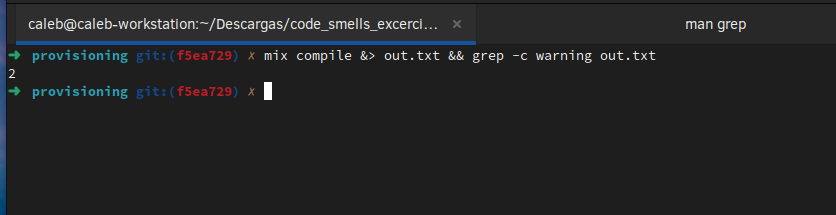
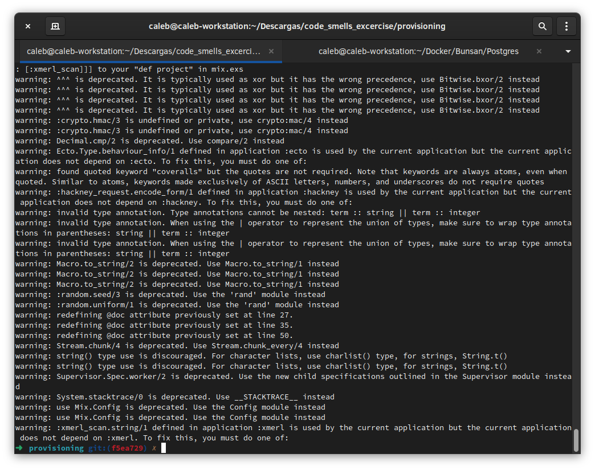

## Lineas de codigo efectivas por proyecto y lenguaje de programacion

El conteo de lineas de codigo se hace con herrramientas como
- cloc
- loc
- gocloc
- Ohcount
- scc
- sclc
- SLOCCount
- Sonar
- tokei
- Unified Code Count

Para el siguiente ejemplo yo utilicé ***cloc***, que cuenta las lineas por archivo, lineas en blanco, comentarios y codigo, se muestra la salida del analisis de 'provisioning', el directorio 'deps' fué ignorado para el analisis. Cloc debe ser ejecutado por separado en cada proyecto.

https://github.com/AlDanial/cloc

## Grafo de dependencias entre los distintos repositorios

Si no existe alguna documentacion previa la manera de crear el diagrama de arquitecura es con un analisis del codigo para encontrar conexiones y dependencias con otros proyectos. Tambien es importante analizar el resultado del arbol de dependecias que arroja 'mix deps.tree', de esta manera se observa que 'provisioning' depende de 'altan' y 'adm'.
El grafico de arquitecura puede ser creado con cualquier herramienta de creacion de diagramas, por ejemplo [Draw.io](app.diagrams.net)

## Métricas de pruebas por proyecto

Las metricas de pruebas se analizan con 'ExCoveralls', para el caso concreto de 'provisioning' el porcentraje que cubren las pruebas a todo el proyecto es 63.6 %, para obtener este dato se ejecuta 'mix coveralls'. El total de pruebas unitarias y las pruebas unitarias falladas se encuentran al ejecutar 'mix test'.

## Warnings de compilación por proyecto

Para obtener la lista de warnings por proyecto se debe ejecutar 'mix compile' en cada uno de ellos, esto regresará una lista con los warnings del proyecto. 

El conteo de warnings se puede hacer con grep, vaciando primero a un archivo la salida de 'mix compile'.

## Conteo de warnings clasificados por tipo
Para contar los warnings, despues de vaciar la salida de 'mix compile' a un archivo tambien se puede usar grep para buscar warnings, realmente se podria crear un script para hacer el conteo en base a una lista de tipos de warnings definidos, en la captura de pantalla que se muestra a continuacion solamente filtré las lineas que contienen la palabra "warning" y las ordené, por lo que el conteo seriá manual.

## Hallazgos de calidad encontrados con herramientas de análisis

Los hallazgos de calidad se muestran al ejecutar 'mix credo' (cuando la dependencia ya está instalada), esto devuelve un conteo de problemas en el codigo clasificados por Warnings, Refactoring opportunities, Consistency y CodeReadability, adicionalmente muestra una descripcion del problema y la localizacion en el archivo, linea y columna.

